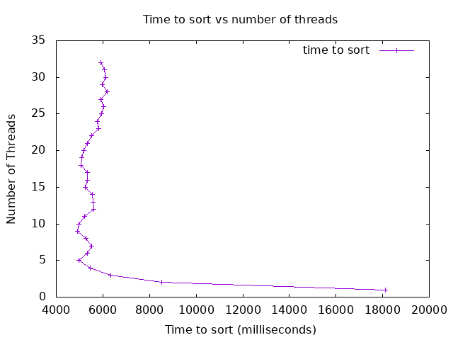

### Analysis

#### Graph

This graph shows the total time to sort an array of 10 million integers vs the number of threads used. The time it takes to sort is recorded in milliseconds. As can be seen, the lower the number of threads used (1-5), the more time it takes to sort an array of this size. Although the more threads above an optimal value, the more time it takes to sort due to thread overhead. This can be seen when the number of threads increases above 20 threads.

#### Were you able to generate something close to what the example showed? Why or why not.
I was able to generate a figure that is decently similar to the example showed. Although it seems that my algorithm runs around 3 seconds slower than the algorithm from the example figure. This could be due a few issues:

1. The compiler I am running is a 32-bit version of a C compiler, although I am running this version on a 64x architecture. This could be an issue that is slowing down the performance of my program.
2. The algorithm is not as optimized as it should be. When merging the sorted chunks together, I use the merge_s function and iterate over each chunk merging them into the previous chunk, although this may not be the best way to do so. I also tried merging all chunks together at once, but this had a worse performance than calling the merge_s function, so I scrapped this.

#### Did you see a slow down at some point why or why not?

I did see an inconsistent slowing effect, especially when the number of threads increased into the 20 or 30 range. I believe this is due to the chunks becoming so small that the time it takes to allocate so many threads and the increased thread overhead contributes to the increased time to sort. Especially when the input size is small, less than 1000, then a larger number of threads noticeably hurts performance.

#### Did your program run faster and faster when you added more threads? Why or why not?

For an input of size greater than 10 million, my program ran faster when adding more and more threads up until a limit of around 20 threads. Once going higher than that, then the thread overhead starts to disrupt the performance. Although depending on the size of the input array, then the number of threads that is optimal will change.

#### What was the optimum number of threads for your machine?

The optimal number of threads for my machine when running with 2 cores (I am running my program through codespaces) is around 10. When adding more threads, the performance doesn't improve much, but rather seems more volatile.

#### What was the slowest number of threads for your machine?

The slowest number of threads for my machine was 1 thread which took around 18 seconds to run. Although this isn't technically multi-threaded, so the slowest multi-threaded number of threads is 2, at around 8.5 seconds. 